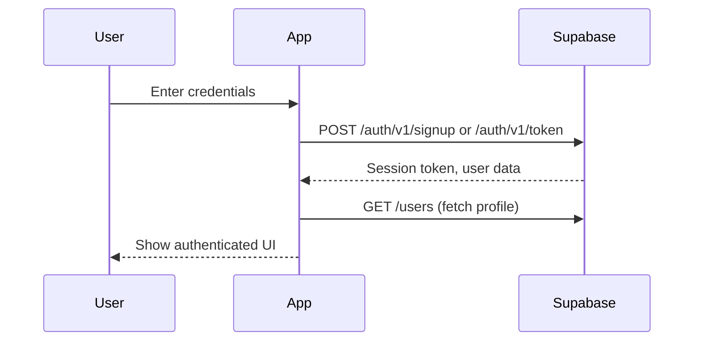
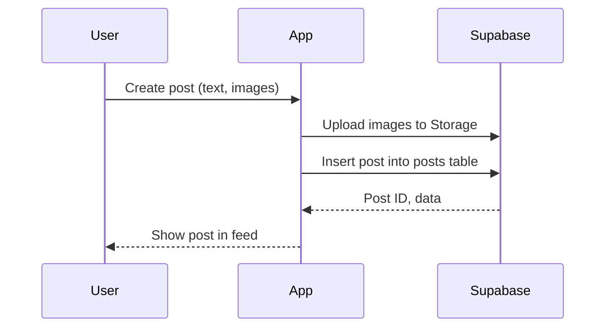
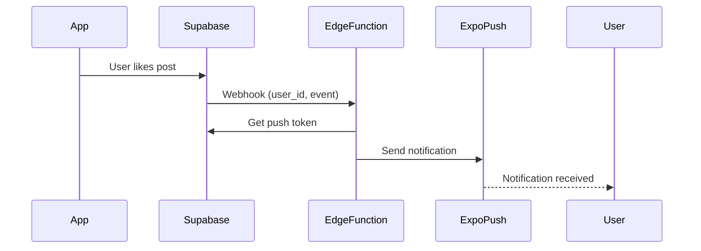
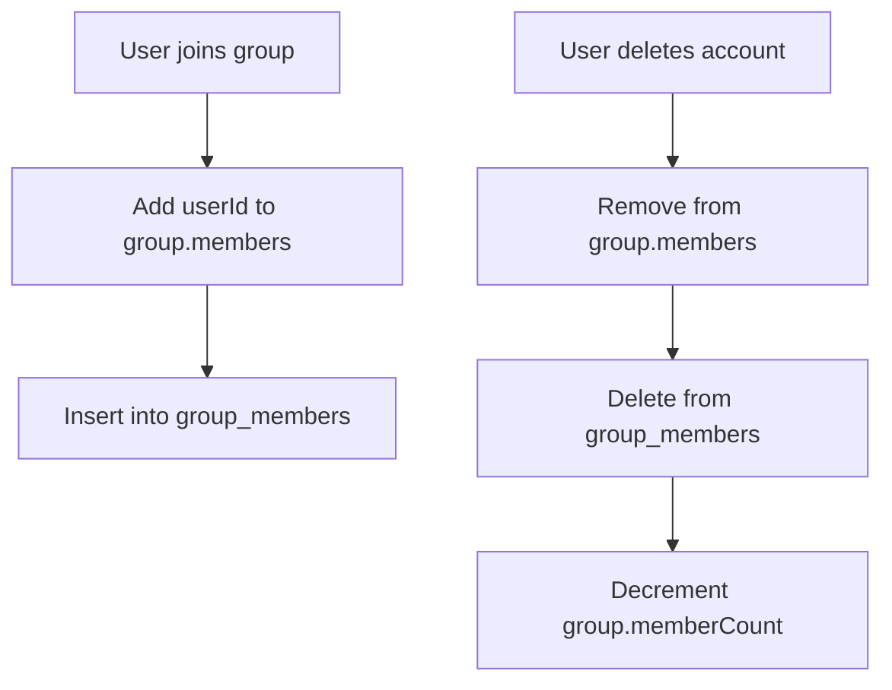
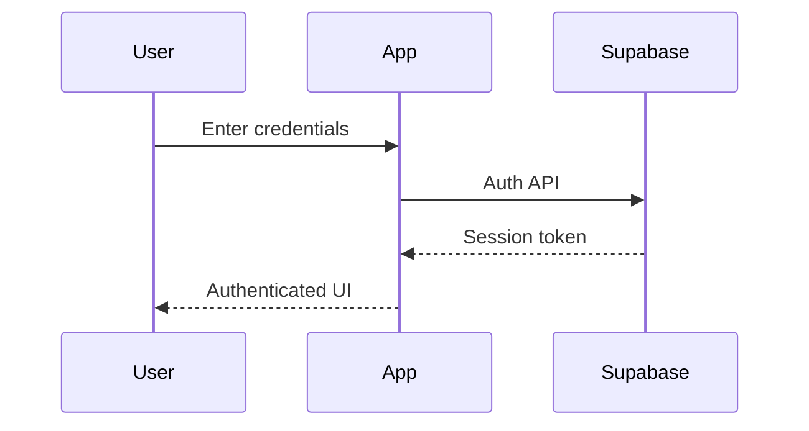
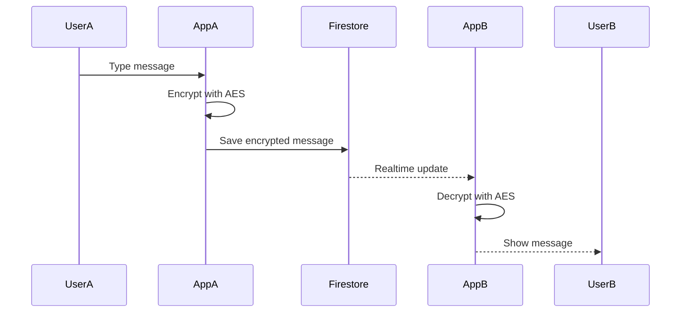
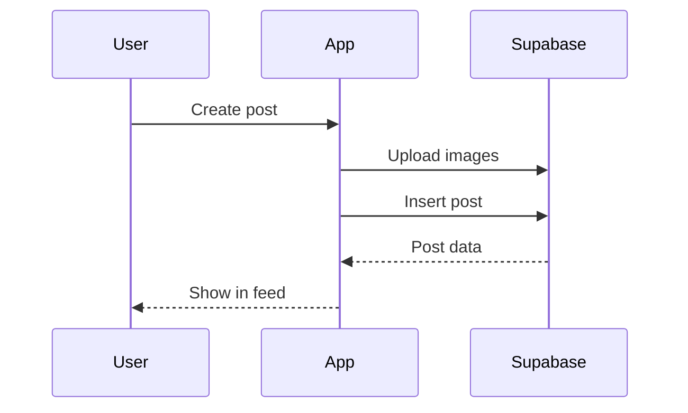
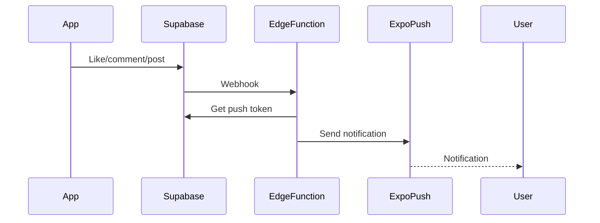
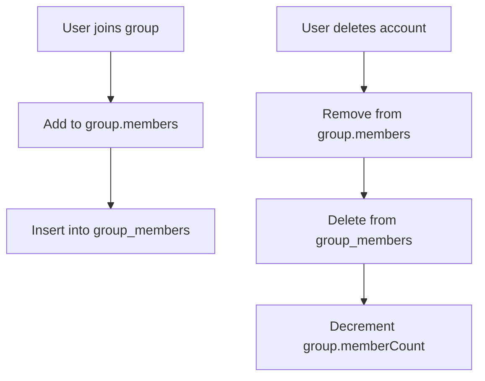

# SocialZ App – Technical Documentation

---

## Table of Contents

1. [Overview](#overview)
2. [Tech Stack](#tech-stack)
3. [Authentication](#authentication)
4. [User Profiles](#user-profiles)
5. [Chat & Messaging (with AES)](#chat--messaging-with-aes)
6. [Posts & Feed](#posts--feed)
7. [Notifications (Webhooks & Edge Functions)](#notifications-webhooks--edge-functions)
8. [Groups & Membership](#groups--membership)
9. [Settings & Account Deletion](#settings--account-deletion)
10. [Data Flow Diagrams](#data-flow-diagrams)
11. [Best Practices](#best-practices)
12. [Extending the App](#extending-the-app)

---

## Overview

**SocialZ** is a modern, real-time social platform for students and young professionals, featuring chat, groups, posts, notifications, and gamification (streaks). The app is built with React Native (Expo), Supabase, and Firebase (for legacy chat).

---

## Tech Stack

- **Frontend:** React Native (Expo)
- **Backend:** Supabase (Postgres, Auth, Storage, Edge Functions)
- **Realtime:** Supabase Realtime, Firestore listeners
- **Notifications:** Expo Notifications, Supabase Edge Functions
- **Encryption:** AES (planned, see below)
- **State Management:** Zustand, React Context

---

## Authentication

### How It Works

- **Supabase Auth** is used for all authentication (email/password, OAuth).
- On sign-up, a user record is created in the `users` table.
- Auth state is managed via `useAuthStore` and Supabase session.
- **Security:** All sensitive actions (delete, update) require authentication.

### Flow



---

## User Profiles

- **Stored in:** Supabase `users` table.
- **Fields:** id, full_name, email, profile_image, college, etc.
- **Edit Profile:** Updates are sent to Supabase.
- **Avatar:** Uploaded to Supabase Storage.

---

## Chat & Messaging (with AES)

### Data Model

- **Chats:** Firestore `chats` collection (each chat has a unique ID, participants array, lastMessage, lastMessageTime).
- **Messages:** Subcollection `chats/{chatId}/messages` (fields: text, senderId, timestamp, deleted, etc.).

### AES Encryption (Planned/Partial)

- **Goal:** Encrypt message content before storing in Firestore.
- **How:** Use AES (e.g., CryptoJS or react-native-crypto-js).
- **Key Management:** Each chat can have a unique AES key (generated and shared at chat creation).

#### Example Implementation

```js
import { AES, enc } from 'react-native-crypto-js';

const SECRET_KEY = "kliq-secure-messaging-2024"; // In production, use a unique key per chat!

// Encrypt
const encryptMessage = (text) => AES.encrypt(text, SECRET_KEY).toString();

// Decrypt
const decryptMessage = (cipher) => AES.decrypt(cipher, SECRET_KEY).toString(enc.Utf8);
```

- **On Send:** Encrypt message before saving to Firestore.
- **On Receive:** Decrypt message after fetching from Firestore.

#### Message Deletion

- When a message is deleted, if it was the last message, update the chat document’s `lastMessage` and `lastMessageTime` to the new latest message (or clear if none).

#### Handling Deleted Users

- If a user is deleted, chats show “Unknown User” and block messaging.

---

## Posts & Feed

### How Posts Are Created

- **Create Post:** User fills out a form (text, images).
- **Upload Images:** Images are uploaded to Supabase Storage.
- **Save Post:** Post data (user_id, content, image URLs, timestamps) is inserted into the `posts` table in Supabase.
- **Feed:** Posts are fetched from Supabase, ordered by `created_at`.
- **Likes/Comments:** Users can like and comment; counts are updated in real-time.
- **Save Post:** Users can save posts for later (saved_posts table).

#### Example Flow



---

## Notifications (Webhooks & Edge Functions)

### How Notifications Work

- **Push Notifications:** Sent via Expo Notifications.
- **Trigger:** When a user likes/comments/posts, an event is triggered.
- **Supabase Edge Function:** A serverless function (written in Deno/TypeScript) is invoked via webhook or directly from the app/backend.
- **Function Logic:** Looks up the recipient’s Expo push token, sends a notification via Expo’s API.

#### Example Edge Function (Deno)

```ts
import { serve } from 'std/server';
serve(async (req) => {
  const { user_id, message } = await req.json();
  // Fetch push token from Supabase
  // Call Expo push API
  return new Response(JSON.stringify({ success: true }));
});
```

#### Flow



---

## Groups & Membership

### How Groups Work

- **Groups Table:** Firestore `groups` collection (fields: id, name, members array, memberCount, etc.).
- **Membership:** Managed via `group_members` join table (userId, groupId).
- **Join/Leave:** When a user joins, their ID is added to the group’s members array and a record is added to `group_members`.
- **Delete User:** On account deletion, user is removed from all groups and group_members, and group member counts are decremented.

#### Example Flow



---

## Settings & Account Deletion

- **Settings Page:** Allows users to manage notifications, privacy, and account.
- **Delete Account:**  
  - Cleans up all user data in Firebase (groups, group_members, chats, users).
  - Supabase data is NOT deleted (for audit/history).
  - After deletion, user is logged out and redirected to auth screen.

---

## Data Flow Diagrams

### 1. **Authentication**



### 2. **Chat Message (with AES)**



### 3. **Post Creation**



### 4. **Notification via Edge Function**



### 5. **Group Membership**



---

## Best Practices

- **Security:** All sensitive actions require authentication and confirmation.
- **Error Handling:** All async actions have try/catch and user feedback.
- **Realtime:** Use Firestore listeners and Supabase Realtime for live updates.
- **State Management:** Use Zustand and React Context for global state.
- **Code Organization:** API logic in `(apis)/`, UI in `components/`, screens in `app/`.
- **Testing:** Manual and automated tests for all critical flows.

---

## Extending the App

- **Add a Feature:**  
  1. Create a new component or screen.
  2. Add API logic to `(apis)/`.
  3. Update state management if needed.
  4. Add error handling and loading states.
  5. Test thoroughly.

- **Add a Database Table:**  
  1. Update Supabase schema.
  2. Add new API functions.
  3. Update relevant UI.

- **Contribute:**  
  - Follow code style in existing files.
  - Write clear commit messages.
  - Test all changes before PR.

---

## Final Notes

- All features are modular and follow a clear separation of concerns.
- Realtime and error handling are first-class citizens.
- The app is ready for production and easy to extend. 